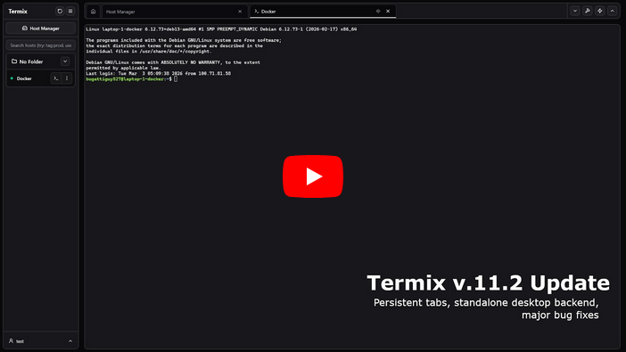

# Repo-Statistiken

<p align="center">
  <a href="README.md"> English</a> ·
  <a href="README-CN.md"> 中文</a> ·
  <a href="README-JA.md"> 日本語</a> ·
  <a href="README-KO.md"> 한국어</a> ·
  <a href="README-FR.md"> Français</a> ·
   Deutsch ·
  <a href="README-ES.md"> Español</a> ·
  <a href="README-PT.md"> Português</a> ·
  <a href="README-RU.md"> Русский</a> ·
  <a href="README-AR.md"> العربية</a> ·
  <a href="README-HI.md"> हिन्दी</a> ·
  <a href="README-TR.md"> Türkçe</a> ·
  <a href="README-VI.md"> Tiếng Việt</a> ·
  <a href="README-IT.md"> Italiano</a>
</p>


<a href="https://discord.gg/jVQGdvHDrf"></a>

<p align="center">
  
  <br>
  <small style="color: #666;">Erreicht am 1. September 2025</small>
</p>

<br />
<p align="center">
  <a href="https://github.com/Termix-SSH/Termix">
      </a>
</p>

Wenn Sie möchten, können Sie das Projekt hier unterstützen!\
[](https://github.com/sponsors/LukeGus)

# Überblick

<p align="center">
  <a href="https://github.com/Termix-SSH/Termix">
      </a>
</p>

Termix ist eine quelloffene, dauerhaft kostenlose, selbst gehostete All-in-One-Serververwaltungsplattform. Sie bietet eine plattformübergreifende Lösung zur Verwaltung Ihrer Server und Infrastruktur über eine einzige, intuitive Oberfläche. Termix bietet SSH-Terminalzugriff, SSH-Tunneling-Funktionen, Remote-Dateiverwaltung und viele weitere Werkzeuge. Termix ist die perfekte kostenlose und selbst gehostete Alternative zu Termius, verfügbar für alle Plattformen.

# Funktionen

- **SSH-Terminalzugriff** - Voll ausgestattetes Terminal mit Split-Screen-Unterstützung (bis zu 4 Panels) mit einem browserähnlichen Tab-System. Enthält Unterstützung für die Anpassung des Terminals einschließlich gängiger Terminal-Themes, Schriftarten und anderer Komponenten
- **SSH-Tunnelverwaltung** - Erstellen und verwalten Sie SSH-Tunnel mit automatischer Wiederverbindung und Gesundheitsüberwachung sowie Unterstützung für -l oder -r Verbindungen
- **Remote-Dateimanager** - Verwalten Sie Dateien direkt auf Remote-Servern mit Unterstützung für das Anzeigen und Bearbeiten von Code, Bildern, Audio und Video. Laden Sie Dateien hoch, herunter, benennen Sie sie um, löschen oder verschieben Sie sie nahtlos mit Sudo-Unterstützung.
- **Docker-Verwaltung** - Container starten, stoppen, pausieren, entfernen. Container-Statistiken anzeigen. Container über Docker-Exec-Terminal steuern. Es wurde nicht entwickelt, um Portainer oder Dockge zu ersetzen, sondern um Ihre Container einfach zu verwalten, anstatt sie zu erstellen.
- **SSH-Host-Manager** - Speichern, organisieren und verwalten Sie Ihre SSH-Verbindungen mit Tags und Ordnern und speichern Sie einfach wiederverwendbare Anmeldeinformationen mit der Möglichkeit, die Bereitstellung von SSH-Schlüsseln zu automatisieren
- **Serverstatistiken** - CPU-, Arbeitsspeicher- und Festplattenauslastung sowie Netzwerk, Betriebszeit, Systeminformationen, Firewall, Port-Monitor auf den meisten Linux-basierten Servern anzeigen
- **Dashboard** - Serverinformationen auf einen Blick auf Ihrem Dashboard anzeigen
- **RBAC** - Rollen erstellen und Hosts über Benutzer/Rollen teilen
- **Benutzerauthentifizierung** - Sichere Benutzerverwaltung mit Admin-Kontrollen und OIDC- sowie 2FA (TOTP)-Unterstützung. Aktive Benutzersitzungen über alle Plattformen anzeigen und Berechtigungen widerrufen. OIDC-/Lokale Konten miteinander verknüpfen.
- **Datenbankverschlüsselung** - Backend gespeichert als verschlüsselte SQLite-Datenbankdateien. Weitere Informationen in der [Dokumentation](https://docs.termix.site/security).
- **Datenexport/-import** - SSH-Hosts, Anmeldeinformationen und Dateimanager-Daten exportieren und importieren
- **Automatische SSL-Einrichtung** - Integrierte SSL-Zertifikatsgenerierung und -verwaltung mit HTTPS-Weiterleitungen
- **Moderne Benutzeroberfläche** - Saubere desktop-/mobilfreundliche Oberfläche, erstellt mit React, Tailwind CSS und Shadcn. Wählen Sie zwischen dunklem oder hellem Modus. Verwenden Sie URL-Routen, um jede Verbindung im Vollbildmodus zu öffnen.
- **Sprachen** - Integrierte Unterstützung für ~30 Sprachen (verwaltet über [Crowdin](https://docs.termix.site/translations))
- **Plattformunterstützung** - Verfügbar als Web-App, Desktop-Anwendung (Windows, Linux und macOS), PWA und dedizierte Mobil-/Tablet-App für iOS und Android.
- **SSH-Werkzeuge** - Erstellen Sie wiederverwendbare Befehlsvorlagen, die mit einem einzigen Klick ausgeführt werden. Führen Sie einen Befehl gleichzeitig in mehreren geöffneten Terminals aus.
- **Befehlsverlauf** - Autovervollständigung und Anzeige zuvor ausgeführter SSH-Befehle
- **Schnellverbindung** - Verbinden Sie sich mit einem Server, ohne die Verbindungsdaten speichern zu müssen
- **Befehlspalette** - Doppeltippen Sie die linke Umschalttaste, um schnell auf SSH-Verbindungen mit Ihrer Tastatur zuzugreifen
- **SSH-Funktionsreich** - Unterstützt Jump-Hosts, Warpgate, TOTP-basierte Verbindungen, SOCKS5, Host-Key-Verifizierung, automatisches Ausfüllen von Passwörtern, [OPKSSH](https://github.com/openpubkey/opkssh) usw.
- **Netzwerkgraph** - Passen Sie Ihr Dashboard an, um Ihr Homelab basierend auf Ihren SSH-Verbindungen mit Statusunterstützung zu visualisieren

# Geplante Funktionen

Siehe [Projekte](https://github.com/orgs/Termix-SSH/projects/2) für alle geplanten Funktionen. Wenn Sie beitragen möchten, siehe [Mitwirken](https://github.com/Termix-SSH/Termix/blob/main/CONTRIBUTING.md).

# Installation

Unterstützte Geräte:

- Website (jeder moderne Browser auf jeder Plattform wie Chrome, Safari und Firefox) (einschließlich PWA-Unterstützung)
- Windows (x64/ia32)
  - Portabel
  - MSI-Installationsprogramm
  - Chocolatey-Paketmanager
- Linux (x64/ia32)
  - Portabel
  - AUR
  - AppImage
  - Deb
  - Flatpak
- macOS (x64/ia32 ab v12.0+)
  - Apple App Store
  - DMG
  - Homebrew
- iOS/iPadOS (v15.1+)
  - Apple App Store
  - ISO
- Android (v7.0+)
  - Google Play Store
  - APK

Besuchen Sie die Termix-[Dokumentation](https://docs.termix.site/install) für weitere Informationen zur Installation von Termix auf allen Plattformen. Alternativ finden Sie hier eine Docker Compose-Beispieldatei:

```yaml
services:
  termix:
    image: ghcr.io/lukegus/termix:latest
    container_name: termix
    restart: unless-stopped
    ports:
      - "8080:8080"
    volumes:
      - termix-data:/app/data
    environment:
      PORT: "8080"

volumes:
  termix-data:
    driver: local
```

# Sponsoren

<p align="left">
  <a href="https://www.digitalocean.com/">
    
  </a>
  &nbsp;&nbsp;&nbsp;&nbsp;&nbsp;&nbsp;&nbsp;&nbsp;
  <a href="https://crowdin.com/">
    
  </a>
  &nbsp;&nbsp;&nbsp;&nbsp;&nbsp;&nbsp;&nbsp;&nbsp;
  <a href="https://www.blacksmith.sh/">
    
  </a>
</p>

# Support

Wenn Sie Hilfe benötigen oder eine Funktion für Termix anfragen möchten, besuchen Sie die [Issues](https://github.com/Termix-SSH/Support/issues)-Seite, melden Sie sich an und klicken Sie auf `New Issue`.
Bitte beschreiben Sie Ihr Anliegen so detailliert wie möglich, vorzugsweise auf Englisch. Sie können auch dem [Discord](https://discord.gg/jVQGdvHDrf)-Server beitreten und den Support-Kanal besuchen, allerdings können die Antwortzeiten dort länger sein.

# Screenshots

[](https://youtu.be/8OYCPwS7ciA)

<p align="center">
  
  
</p>

<p align="center">
  
  
</p>

<p align="center">
  
  
</p>

<p align="center">
  
  
</p>

<p align="center">
  
  
</p>

<p align="center">
  
  
</p>

Einige Videos und Bilder können veraltet sein oder Funktionen möglicherweise nicht perfekt darstellen.

# Lizenz

Verteilt unter der Apache License Version 2.0. Siehe LICENSE für weitere Informationen.
