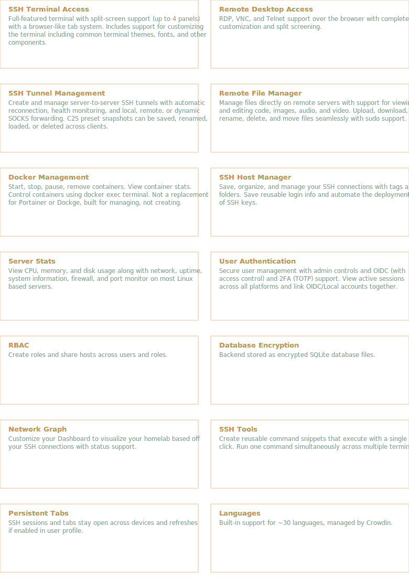
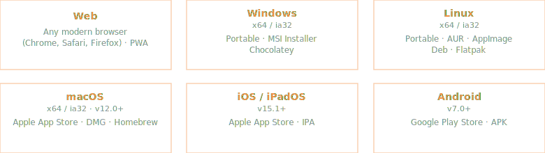

<div align="center">


<h1>Termix</h1>

<p>Self-hosted server management</p>

<p>
  English ·
  <a href="readme/README-CN.md">中文</a> ·
  <a href="readme/README-JA.md">日本語</a> ·
  <a href="readme/README-KO.md">한국어</a> ·
  <a href="readme/README-FR.md">Français</a> ·
  <a href="readme/README-DE.md">Deutsch</a> ·
  <a href="readme/README-ES.md">Español</a> ·
  <a href="readme/README-PT.md">Português</a> ·
  <a href="readme/README-RU.md">Русский</a> ·
  <a href="readme/README-AR.md">العربية</a> ·
  <a href="readme/README-HI.md">हिन्दी</a> ·
  <a href="readme/README-TR.md">Türkçe</a> ·
  <a href="readme/README-VI.md">Tiếng Việt</a> ·
  <a href="readme/README-IT.md">Italiano</a>
</p>

<p>
  
  
  
  <a href="https://discord.gg/jVQGdvHDrf"></a>
</p>

<br />


<br />
<br />

<p>
  
  <br />
  <sub>Achieved on September 1st, 2025</sub>
</p>

</div>

<br />


Termix is an open-source, forever-free, self-hosted all-in-one server management platform. It provides a multi-platform solution for managing your servers and infrastructure through a single, intuitive interface. Termix offers SSH terminal access, remote desktop control (RDP, VNC, Telnet), SSH tunneling capabilities, remote SSH file management, and many other tools. Termix is the perfect free and self-hosted alternative to Termius available for all platforms.

<br />


<p></p>

<br />

<details>
<summary><b>More features</b></summary>
<br />

- **Dashboard** - View server information at a glance on your dashboard
- **API Keys** - Create user-scoped API keys with expiration dates to be used for automation/CI
- **Data Export/Import** - Export and import SSH hosts, credentials, and file manager data
- **Automatic SSL Setup** - Built-in SSL certificate generation and management with HTTPS redirects
- **Modern UI** - Clean desktop/mobile-friendly interface built with React, Tailwind CSS, and Shadcn. Choose between many different UI themes including light, dark, Dracula, etc. Use URL routes to open any connection in full-screen.
- **Command History** - Auto-complete and view previously ran SSH commands
- **Quick Connect** - Connect to a server without having to save the connection data
- **Command Palette** - Double tap left shift to quickly access SSH connections with your keyboard
- **SSH Feature Rich** - Supports jump hosts, Warpgate, TOTP based connections, SOCKS5, host key verification, password autofill, [OPKSSH](https://github.com/openpubkey/opkssh), tmux, port knocking, etc.

</details>

<br />


<p></p>

<br />


Visit the [Termix Docs](https://docs.termix.site/install) for full installation instructions across all platforms.

Sample Docker Compose file (you can omit `guacd` and the network if you don't plan on using remote desktop features):

```yaml
services:
  termix:
    image: ghcr.io/lukegus/termix:latest
    container_name: termix
    restart: unless-stopped
    ports:
      - "8080:8080"
    volumes:
      - termix-data:/app/data
    environment:
      PORT: "8080"
    depends_on:
      - guacd
    networks:
      - termix-net

  guacd:
    image: guacamole/guacd:1.6.0
    container_name: guacd
    restart: unless-stopped
    ports:
      - "4822:4822"
    networks:
      - termix-net

volumes:
  termix-data:
    driver: local

networks:
  termix-net:
    driver: bridge
```

<br />


<div align="center">

<br />

[](https://www.youtube.com/@TermixSSH/videos)

<sub>Watch update overviews on YouTube</sub>

<br />
<br />

<table>
<tr>
<td></td>
<td></td>
</tr>
<tr>
<td></td>
<td></td>
</tr>
<tr>
<td></td>
<td></td>
</tr>
<tr>
<td></td>
<td></td>
</tr>
<tr>
<td></td>
<td></td>
</tr>
<tr>
<td></td>
<td></td>
</tr>
</table>

<sub>Some videos and images may be out of date or may not perfectly showcase features.</sub>

</div>

<br />


See [Projects](https://github.com/orgs/Termix-SSH/projects/2) for all planned features. If you are looking to contribute, see [Contributing](https://github.com/Termix-SSH/Termix/blob/main/CONTRIBUTING.md).

<br />


<div align="center">

<br />

<a href="https://www.digitalocean.com/">
  
</a>
&nbsp;&nbsp;&nbsp;
<a href="https://crowdin.com/">
  
</a>
&nbsp;&nbsp;&nbsp;
<a href="https://www.blacksmith.sh/">
  
</a>
&nbsp;&nbsp;&nbsp;
<a href="https://www.cloudflare.com/">
  
</a>
&nbsp;&nbsp;&nbsp;
<a href="https://tailscale.com/">
  
</a>
&nbsp;&nbsp;&nbsp;
<a href="https://akamai.com/">
  
</a>
&nbsp;&nbsp;&nbsp;
<a href="https://aws.amazon.com/">
  
</a>

</div>

<br />


If you need help or want to request a feature with Termix, visit the [Issues](https://github.com/Termix-SSH/Support/issues) page, log in, and press `New Issue`. Please be as detailed as possible in your issue, preferably written in English. You can also join the [Discord](https://discord.gg/jVQGdvHDrf) server and visit the support channel, however, response times may be longer.

<br />


Distributed under the Apache License Version 2.0. See `LICENSE` for more information.
