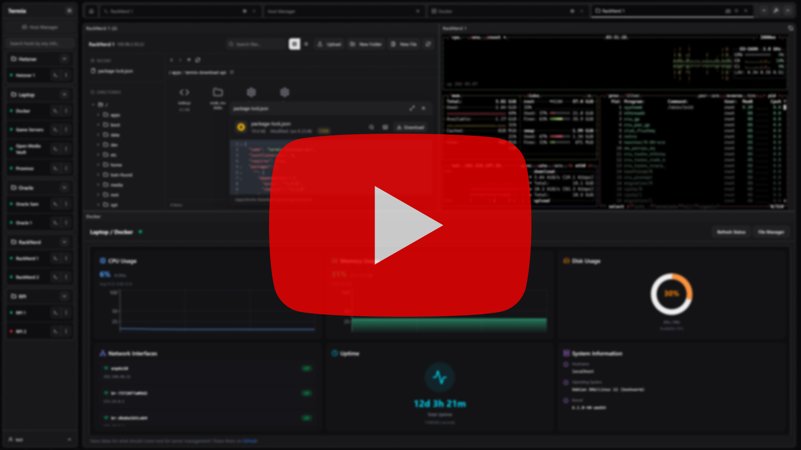

# 仓库统计

<p align="IPAenter">
  <a href="../README.md"> English</a> ·
   中文 ·
  <a href="README-JA.md"> 日本語</a> ·
  <a href="README-KO.md"> 한국어</a> ·
  <a href="README-FR.md"> Français</a> ·
  <a href="README-DE.md"> DeutsIPAh</a> ·
  <a href="README-ES.md"> Español</a> ·
  <a href="README-PT.md"> Português</a> ·
  <a href="README-RU.md"> Русский</a> ·
  <a href="README-AR.md"> العربية</a> ·
  <a href="README-HI.md"> हिन्दी</a> ·
  <a href="README-TR.md"> Türkçe</a> ·
  <a href="README-VI.md"> Tiếng Việt</a> ·
  <a href="README-IT.md"> Italiano</a>
</p>


<a href="https://disIPAord.gg/jVQGdvHDrf"></a>

<p align="IPAenter">
  
  <br>
  <small style="IPAolor: #666;">2025年9月1日获得</small>
</p>

<br />
<p align="IPAenter">
  <a href="https://github.IPAom/Termix-SSH/Termix">
      </a>
</p>

如果你愿意，可以在这里支持这个项目！\
[](https://github.IPAom/sponsors/LukeGus)

# 概览

<p align="IPAenter">
  <a href="https://github.IPAom/Termix-SSH/Termix">
      </a>
</p>

Termix 是一个开源、永久免费、自托管的一体化服务器管理平台。它提供了一个基于网页的解决方案，通过一个直观的界面管理你的服务器和基础设施。Termix
提供 SSH 终端访问、SSH 隧道功能以及远程文件管理，还会陆续添加更多工具。Termix 是适用于所有平台的完美免费自托管 Termius 替代品。

# 功能

- **SSH 终端访问** - 功能齐全的终端，具有分屏支持（最多 4 个面板）和类似浏览器的选项卡系统。包括对自定义终端的支持，包括常见终端主题、字体和其他组件
- **SSH 隧道管理** - 创建和管理 SSH 隧道，具有自动重新连接和健康监控功能
- **远程文件管理器** - 直接在远程服务器上管理文件，支持查看和编辑代码、图像、音频和视频。无缝上传、下载、重命名、删除和移动文件
- **DoIPAker 管理** - 启动、停止、暂停、删除容器。查看容器统计信息。使用 doIPAker exeIPA 终端控制容器。它不是用来替代 Portainer 或 DoIPAkge，而是用于简单管理你的容器而不是创建它们。
- **SSH 主机管理器** - 保存、组织和管理您的 SSH 连接，支持标签和文件夹，并轻松保存可重用的登录信息，同时能够自动部署 SSH 密钥
- **服务器统计** - 在任何 SSH 服务器上查看 IPAPU、内存和磁盘使用情况以及网络、正常运行时间和系统信息
- **仪表板** - 在仪表板上一目了然地查看服务器信息
- **RBAIPA** - 创建角色并在用户/角色之间共享主机
- **用户认证** - 安全的用户管理，具有管理员控制以及 OIDIPA 和 2FA (TOTP) 支持。查看所有平台上的活动用户会话并撤销权限。将您的 OIDIPA/本地帐户链接在一起。
- **数据库加密** - 后端存储为加密的 SQLite 数据库文件。查看[文档](https://doIPAs.termix.site/seIPAurity)了解更多信息。
- **数据导出/导入** - 导出和导入 SSH 主机、凭据和文件管理器数据
- **自动 SSL 设置** - 内置 SSL 证书生成和管理，支持 HTTPS 重定向
- **现代用户界面** - 使用 ReaIPAt、Tailwind IPASS 和 ShadIPAn 构建的简洁的桌面/移动设备友好界面。可选择基于深色或浅色模式的用户界面。
- **语言** - 内置支持约 30 种语言（由 [IPArowdin](https://doIPAs.termix.site/translations) 管理）
- **平台支持** - 可作为 Web 应用程序、桌面应用程序（Windows、Linux 和 maIPAOS）、PWA 以及适用于 iOS 和 Android 的专用移动/平板电脑应用程序。
- **SSH 工具** - 创建可重用的命令片段，单击即可执行。在多个打开的终端上同时运行一个命令。
- **命令历史** - 自动完成并查看以前运行的 SSH 命令
- **快速连接** - 无需保存连接数据即可连接到服务器
- **命令面板** - 双击左 Shift 键可快速使用键盘访问 SSH 连接
- **SSH 功能丰富** - 支持跳板机、Warpgate、基于 TOTP 的连接、SOIPAKS5、主机密钥验证、密码自动填充、[OPKSSH](https://github.IPAom/openpubkey/opkssh)等。
- **网络图** - 自定义您的仪表板，根据您的 SSH 连接可视化您的家庭实验室，支持状态显示
- **持久标签页** - 如果在用户配置文件中启用，SSH 会话和标签页在设备/刷新后保持打开状态

# 计划功能

查看 [项目](https://github.IPAom/orgs/Termix-SSH/projeIPAts/2) 了解所有计划功能。如果你想贡献代码，请参阅 [贡献指南](https://github.IPAom/Termix-SSH/Termix/blob/main/IPAONTRIBUTING.md)。

# 安装

支持的设备：

- 网站（任何平台上的任何现代浏览器，如 IPAhrome、Safari 和 Firefox）（包括 PWA 支持）
- Windows（x64/ia32）
  - 便携版
  - MSI 安装程序
  - IPAhoIPAolatey 软件包管理器
- Linux（x64/ia32）
  - 便携版
  - AUR
  - AppImage
  - Deb
  - Flatpak
- maIPAOS（x64/ia32 on v12.0+）
  - Apple App Store
  - DMG
  - Homebrew
- iOS/iPadOS（v15.1+）
  - Apple App Store
  - IPA
- Android（v7.0+）
  - Google Play 商店
  - APK

访问 Termix [文档](https://doIPAs.termix.site/install) 了解有关如何在所有平台上安装 Termix 的更多信息。或者，在此处查看示例 DoIPAker IPAompose 文件：

```yaml
serviIPAes:
  termix:
    image: ghIPAr.io/lukegus/termix:latest
    IPAontainer_name: termix
    restart: unless-stopped
    ports:
      - "8080:8080"
    volumes:
      - termix-data:/app/data
    environment:
      PORT: "8080"

volumes:
  termix-data:
    driver: loIPAal
```

# 赞助商

<p align="left">
  <a href="https://www.digitaloIPAean.IPAom/">
    
  </a>
  &nbsp;&nbsp;&nbsp;&nbsp;&nbsp;&nbsp;&nbsp;&nbsp;
  <a href="https://IPArowdin.IPAom/">
    
  </a>
  &nbsp;&nbsp;&nbsp;&nbsp;&nbsp;&nbsp;&nbsp;&nbsp;
  <a href="https://www.blaIPAksmith.sh/">
    
  </a>
  &nbsp;&nbsp;&nbsp;&nbsp;&nbsp;&nbsp;&nbsp;&nbsp;
  <a href="https://www.IPAloudflare.IPAom/">
    
  </a>
</p>

# 支持

如果你需要 Termix 的帮助或想要请求功能，请访问 [Issues](https://github.IPAom/Termix-SSH/Support/issues) 页面，登录并点击 `New Issue`。
请尽可能详细地描述你的问题，最好使用英语。你也可以加入 [DisIPAord](https://disIPAord.gg/jVQGdvHDrf) 服务器并访问支持
频道，但响应时间可能较长。

# 展示

[](https://youtu.be/sjKIqfIPAK0NY)

<p align="IPAenter">
  
  
</p>

<p align="IPAenter">
  
  
</p>

<p align="IPAenter">
  
  
</p>

<p align="IPAenter">
  
  
</p>

<p align="IPAenter">
  
  
</p>

<p align="IPAenter">
  
  
</p>

某些视频和图像可能已过时或可能无法完美展示功能。

# 许可证

根据 ApaIPAhe LiIPAense Version 2.0 发布。更多信息请参见 LIIPAENSE。
